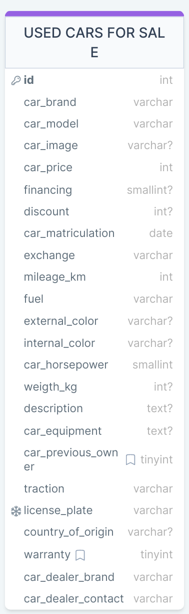

# `USED CARS FOR SALE` 

| ID [PRIMARY_KEY]  | Rows (Tuple)               | Column   (attributes) | NULL or NOTNULL|
| :---              |    :----:                  |                :----: |            ---:|
|  1                |  car_brand                 | VARCHAR(255)          |    NOTNULL     |            
|  2                |  car_model                 | VARCHAR(255)          |    NOTNULL     |
|  3                |  car_image                 | VARCHAR(255)          |    NULL        |  
|  4                |  car_price                 | INT                   |    NOTNULL     |
|  5                |  financing                 | UNSIGNED SMALLINT     |    NULL        |
|  6                |  discount                  | INT                   |    NULL        |
|  7                |  car_matriculation         | DATE                  |    NOTNULL     |   
|  8                |  exchange                  | VARCHAR(255)          |    NOTNULL     |  
|  9                |  mileage_km                | INT                   |    NOTNULL     |
|  10               |  fuel                      | VARCHAR(255)          |    NOTNULL     |
|  11               |  external_color            | VARCHAR(255)          |    NULL        |
|  12               |  internal_color            | VARCHAR(255)          |    NULL        |
|  13               |  car_horsepower            | SMALLINT              |    NOTNULL     |
|  14               |  weigth_kg                 | INT                   |    NULL        |
|  15               |  description               | TEXT                  |    NULL        |
|  16               |  car_equipment             | TEXT                  |    NULL        |
|  17               |  car_previous_owner        | TINYINT - DEFAULT(0)  |    NOTNULL     |
|  18               |  traction                  | VARCHAR(255)          |    NOTNULL     |
|  19               | license_plate              | VARCHAR(255) - UNIQUE |    NOTNULL     |
|  20               | country_of_origin          | VARCHAR(255)          |    NULL        |
|  21               |  warranty                  | TINYINT - DEFAULT(0)  |    NOTNULL     |
|  21               |  car_dealer_brand          | VARCHAR(255)          |    NOTNULL     |
|  21               |  car_dealer_contact        | VARCHAR(255)          |    NOTNULL     |

